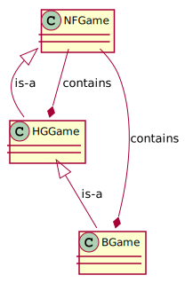

# Game forms and correspondances

We study simultaneous games:

- Games in standard normal form (NF-Game)
- Hyper-graphical games (HG-Game)
- Incomplete games (I-Games) such as bayesian games.

## Dependencies

- A HG-Game describe a NF-Game
- A HG-Game is made of several NF-Games
  Each local game is a NF-game, where local player sets are subsets of the global player set, and such as players have the same set of actions in each local game they play (i.e. they have a unique global set of actions)
- A I-Game may be transformed into a HG-Game by the HR transformation
- A I-Game is made of several NG-Games
  One game by possible signal combination, so uncertainty is about witch possible game is the real game.

## Source code

Diagram made with [PlantUML](http://www.plantuml.com/) using:

	@startuml
	NFGame <|-- HGGame : is-a
	HGGame *-- NFGame : contains
	HGGame <|-- BGame : is-a
	BGame *-- NFGame : contains
	@enduml

